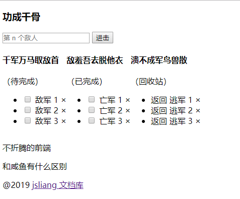
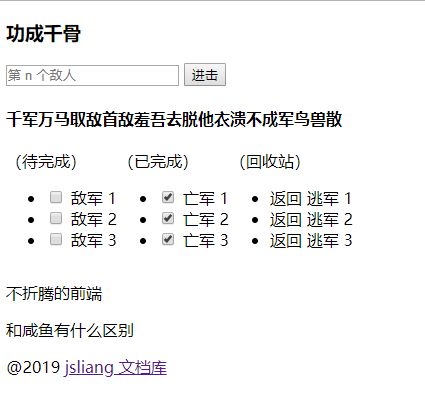
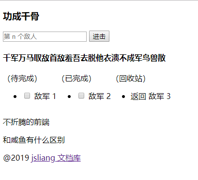
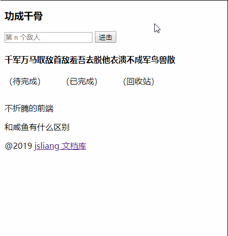

# Vue Demo - 功成千骨

> Create by **jsLe** on **2019-1-2 08:46:46**  
> Recently revised in **2019-05-31 13:54:39**

**Hello 小伙伴们，如果觉得本文还不错，记得给个 **star** ， 你们的 **star** 是我学习折腾的动力！[GitHub 地址](https://github.com/LiangJunrong/document-library)**

抛开 Vue-Cli，使用最简单原始的方式开发一个 TodoList 并不断完善，完成正在进行、完成列表、回收站这三个功能模块，并实现下面这些功能：

- 新增任务
- 改变状态
- 修改任务
- 删除任务

* **成品展示**：


- **代码地址**：[功成千骨 - 代码地址](https://github.com/LiangJunrong/achievement-of-thousands-of-bones)

- **项目地址**：[功成千骨 - 线上地址](http://vuetodo.jsLe.top/)

## <a name="chapter-one" id="chapter-one">一 目录</a>

**不折腾的前端，和咸鱼有什么区别**

| 目录                                      |
| ----------------------------------------- |
| [一 目录](#chapter-one)                   |
| [二 前言](#chapter-two)                   |
| [三 项目解析](#chapter-three)             |
| [四 骨架 - HTML](#chapter-four)           |
| [五 功能 - JS](#chapter-five)             |
| &emsp;[5.1 页面数据化](#chapter-five-one) |
| &emsp;[5.2 数据简化](#chapter-five-two)   |
| &emsp;[5.3 添加数据](#chapter-five-three) |
| &emsp;[5.4 改变状态](#chapter-five-four)  |
| &emsp;[5.5 修改内容](#chapter-five-five)  |
| &emsp;[5.6 数据回收](#chapter-five-six)   |
| &emsp;[5.7 彻底删除](#chapter-five-seven) |
| [六 皮肤 - CSS](#chapter-six)             |
| &emsp;[6.1 重置样式](#chapter-six-one)    |
| &emsp;[6.2 偷天换日](#chapter-six-two)    |
| [七 总结](#chapter-seven)                 |

## <a name="chapter-two" id="chapter-two">二 前言</a>

> [返回目录](#chapter-one)

经过系列的折腾，并且参照不同大佬的“新人作”，将五花八门的 TodoList 各种写法综合起来，从 0 到 1 不依赖 Vue-Cli 打造一个属于自己的 TodoList，后期将加以 Node 的框架 Koa 连接 MySQL 提供接口，从而实现面向大众的 TodoList！

> 欲练此功，必先自宫，额(⊙o⊙)…不对，必先学习 [Vue 系列之 Vue 基础](https://github.com/LiangJunrong/document-library/blob/master/JavaScript-library/Vue/VueBase.md)。

## <a name="chapter-three" id="chapter-three">三 项目解析</a>

> [返回目录](#chapter-one)

在我们平时的工作中，我们应该在拿到 PSD 设计稿或者原型设计的时候，我们应该对我们的功能进行划分，对 HTML、CSS、JS 进行划分，以便于后期的维护制作，下面我们先看一下我们的 UI：


额(⊙o⊙)…

好吧-\_-||

惨不忍睹，我们还是按照这形式，将 HTML 搭建出来，并用 JS 实现功能先吧，后期再填充 CSS 了。

下面是目录结构：


## <a name="chapter-four" id="chapter-four">四 骨架 - HTML</a>

> [返回目录](#chapter-one)

现在，我们先完成 `index.html` 架构。

然后 `index.css` 和 `index.js` 这两个文件，可以是空的，因为我们先架好骨架，再进行 JS 的事件以及 CSS 的渲染。

> index.html

```html
<!DOCTYPE html>
<html lang="en">
  <head>
    <meta charset="UTF-8" />
    <meta
      name="viewport"
      content="width=device-width,initial-scale=1.0,maximum-scale=1.0,user-scalable=no"
    />
    <meta http-equiv="X-UA-Compatible" content="ie=edge" />
    <link rel="shortcut icon" href="./img/favicon.ico" type="image/x-icon" />
    <title>功成千骨</title>

    <!-- css 区 -->
    <link rel="stylesheet" href="./css/reset.css" />
    <link rel="stylesheet" href="./css/index.css" />
    <style>
      .content-list {
        display: flex;
      }
    </style>
  </head>
  <body>
    <!-- html 区 -->
    <div class="main-container" id="app">
      <!-- 头部标题 -->
      <div class="header">
        <h3>功成千骨</h3>
      </div>
      <!-- 内容区 -->
      <div class="content">
        <!-- 输入区 -->
        <div class="content-input-todo">
          <input type="text" placeholder="第 n 个敌人" v-model="todo" />
          <button>进击</button>
        </div>
        <!-- 列表区 -->
        <div class="content-list">
          <!-- 未完成 -->
          <div class="content-list-todo">
            <h4>千军万马取敌首</h4>
            <p>（待完成）</p>
            <ul>
              <li>
                <input type="checkbox" />
                <span class="todo-title">敌军 1</span>
                <span class="icon-recycle">×</span>
              </li>
              <li>
                <input type="checkbox" />
                <span class="todo-title">敌军 2</span>
                <span class="icon-recycle">>×</span>
              </li>
              <li>
                <input type="checkbox" />
                <span class="todo-title">敌军 3</span>
                <span class="icon-recycle">×</span>
              </li>
            </ul>
          </div>
          <!-- 已完成 -->
          <div class="content-list-finish">
            <h4>敌羞吾去脱他衣</h4>
            <p>（已完成）</p>
            <ul>
              <li>
                <input type="checkbox" />
                <span class="todo-title">亡军 1</span>
                <span class="icon-recycle">×</span>
              </li>
              <li>
                <input type="checkbox" />
                <span class="todo-title">亡军 2</span>
                <span class="icon-recycle">×</span>
              </li>
              <li>
                <input type="checkbox" />
                <span class="todo-title">亡军 3</span>
                <span class="icon-recycle">×</span>
              </li>
            </ul>
          </div>
          <!-- 回收站 -->
          <div class="content-list-recycle">
            <h4>溃不成军鸟兽散</h4>
            <p>（回收站）</p>
            <ul>
              <li>
                <span class="content-list-recycle-back">返回</span>
                <span class="todo-title">逃军 1</span>
                <span class="icon-delete">×</span>
              </li>
              <li>
                <span class="content-list-recycle-back">返回</span>
                <span class="todo-title">逃军 2</span>
                <span class="icon-delete">×</span>
              </li>
              <li>
                <span class="content-list-recycle-back">返回</span>
                <span class="todo-title">逃军 3</span>
                <span class="icon-delete">×</span>
              </li>
            </ul>
          </div>
        </div>
        <!--  -->
      </div>
      <!-- 底部信息 -->
      <div class="footer">
        <p>不折腾的前端</p>
        <p>和咸鱼有什么区别</p>
        <p>@2019 <a href="" target="_blank">jsLe 文档库</a></p>
      </div>
    </div>

    <!-- js 区 -->
    <script src="https://cdn.bootcss.com/vue/2.5.21/vue.js"></script>
    <script src="./js/index.js"></script>
  </body>
</html>
```

此时页面内容如下所示：



## <a name="chapter-five" id="chapter-five">五 功能 - JS</a>

> [返回目录](#chapter-one)

搭建好网页的骨架，我们先让它跑起来吧。

你可以上面的 HTML 步骤想象成造了一个骷髅人，然后现在你要施法，要让骷髅人跑起来了。

奔跑吧，骷髅人~

### <a name="chapter-five-one" id="chapter-five-one">5.1 页面数据化</a>

> [返回目录](#chapter-one)

现在，我们进行页面的数据化，我们需要考虑有哪几块是需要变成数据的：**输入的内容**、**todo 项**、**完成项**、**未完成项**。

那么，我们先进行简单抽取：

> index.html 代码片段

```html
<!-- 内容区 -->
<div class="content">
  <!-- 输入区 -->
  <div class="content-input-todo">
    <input type="text" placeholder="第 n 个敌人" v-model="todo" />
    <button>进击</button>
  </div>
  <!-- 列表区 -->
  <div class="content-list">
    <!-- 未完成 -->
    <div class="content-list-todo">
      <h4>千军万马取敌首</h4>
      <p>（待完成）</p>
      <ul>
        <li v-for="todoItem in todoInfos" :key="todoItem.id">
          <input type="checkbox" v-model="todoItem.isChecked" />
          <span class="todo-title" v-text="todoItem.todoTitle"></span>
          <span class="icon-recycle">x</span>
        </li>
      </ul>
    </div>
    <!-- 已完成 -->
    <div class="content-list-finish">
      <h4>敌羞吾去脱他衣</h4>
      <p>（已完成）</p>
      <ul>
        <li v-for="finishItem in finishInfos" :key="finishItem.id">
          <input type="checkbox" v-model="finishItem.isChecked" />
          <span class="todo-title" v-text="finishItem.todoTitle"></span>
          <span class="icon-recycle">x</span>
        </li>
      </ul>
    </div>
    <!-- 回收站 -->
    <div class="content-list-recycle">
      <h4>溃不成军鸟兽散</h4>
      <p>（回收站）</p>
      <ul>
        <li v-for="recycleItem in recycleInfos" :key="recycleItem.id">
          <span class="content-list-recycle-back">返回</span>
          <span class="todo-title" v-text="recycleItem.todoTitle"></span>
          <span class="icon-delete">x</span>
        </li>
      </ul>
    </div>
  </div>
</div>
```

在这里，我们将页面数据化了，现在看下我们的 `index.js` 内容：

> index.js

```js
var app = new Vue({
  el: '#app',
  data: {
    id: 1,
    todo: '',
    todoInfos: [
      {
        id: 7,
        isChecked: false,
        todoTitle: '敌军 1'
      },
      {
        id: 8,
        isChecked: false,
        todoTitle: '敌军 2'
      },
      {
        id: 9,
        isChecked: false,
        todoTitle: '敌军 3'
      }
    ],
    finishInfos: [
      {
        id: 1,
        isChecked: true,
        todoTitle: '亡军 1'
      },
      {
        id: 2,
        isChecked: true,
        todoTitle: '亡军 2'
      },
      {
        id: 3,
        isChecked: true,
        todoTitle: '亡军 3'
      }
    ],
    recycleInfos: [
      {
        id: 4,
        isChecked: false,
        todoTitle: '逃军 1'
      },
      {
        id: 5,
        isChecked: false,
        todoTitle: '逃军 2'
      },
      {
        id: 6,
        isChecked: false,
        todoTitle: '逃军 3'
      }
    ]
  }
})
```

这样，我们就通过 `v-for` 完成了数据的渲染，同时页面和之前的一样：



### <a name="chapter-five-two" id="chapter-five-two">5.2 数据简化</a>

> [返回目录](#chapter-one)

在这里，我们稍微暂停下，观察 `todoInfos`、`finishInfos`、`recycleInfos` 这三个数组，发现它们都是差不多的结构。那么，我们干脆将它合并？

> index.js

```js
var app = new Vue({
  el: '#app',
  data: {
    id: 1,
    todo: '',
    todoInfos: [
      {
        id: 7, // id 唯一且自增
        isChecked: false, // 未完成和放弃为 false，完成为 true
        isEdit: false, // 是否在编辑
        todoTitle: '敌军 1',
        state: 0 // 0 - 未完成，1 - 完成，2 - 放弃完成
      },
      {
        id: 8, // id 唯一且自增
        isChecked: false, // 未完成和放弃为 false，完成为 true
        isEdit: false, // 是否在编辑
        todoTitle: '敌军 2', // todo 标题
        state: 1 // 0 - 未完成，1 - 完成，2 - 放弃完成
      },
      {
        id: 9, // id 唯一且自增
        isChecked: false, // 未完成和放弃为 false，完成为 true
        isEdit: false, // 是否在编辑
        todoTitle: '敌军 3', // todo 标题
        state: 2 // 0 - 未完成，1 - 完成，2 - 放弃完成
      }
    ]
  }
})
```

这样一来，我们就可以修改 HTML，让它通过 `state` 来区分这三块的数据：

> index.html 代码片段

```html
<!-- 内容区 -->
<div class="content">
  <!-- 输入区 -->
  <div class="content-input-todo">
    <input type="text" placeholder="第 n 个敌人" v-model="todo" />
    <button>进击</button>
  </div>
  <!-- 列表区 -->
  <div class="content-list">
    <!-- 未完成 -->
    <div class="content-list-todo">
      <h4>千军万马取敌首</h4>
      <p>（待完成）</p>
      <ul>
        <li
          v-for="todoItem in todoInfos"
          :key="todoItem.id"
          v-if="todoItem.state == 0"
        >
          <input type="checkbox" v-model="todoItem.isChecked" />
          <span
            class="todo-title"
            v-if="!todoItem.isEdit"
            v-text="todoItem.todoTitle"
          ></span>
          <span class="icon-recycle">x</span>
        </li>
      </ul>
    </div>
    <!-- 已完成 -->
    <div class="content-list-finish">
      <h4>敌羞吾去脱他衣</h4>
      <p>（已完成）</p>
      <ul>
        <li
          v-for="finishItem in todoInfos"
          :key="finishItem.id"
          v-if="finishItem.state == 1"
        >
          <input type="checkbox" v-model="finishItem.isChecked" />
          <span
            class="todo-title"
            v-if="!finishItem.isEdit"
            v-text="finishItem.todoTitle"
          ></span>
          <span class="icon-recycle">x</span>
        </li>
      </ul>
    </div>
    <!-- 回收站 -->
    <div class="content-list-recycle">
      <h4>溃不成军鸟兽散</h4>
      <p>（回收站）</p>
      <ul>
        <li
          v-for="recycleItem in todoInfos"
          :key="recycleItem.id"
          v-if="recycleItem.state == 2"
        >
          <span class="content-list-recycle-back">返回</span>
          <span
            class="todo-title"
            v-if="!recycleItem.isEdit"
            v-text="recycleItem.todoTitle"
          ></span>
          <span class="icon-delete">x</span>
        </li>
      </ul>
    </div>
  </div>
</div>
```



此时，我们的页面还是如修改之前一般，但是已经实现了数据化。

下面我们开始写增删改数据的功能方法。

### <a name="chapter-five-three" id="chapter-five-three">5.3 添加数据</a>

> [返回目录](#chapter-one)

**首先**，我们往 HTML 中添加点击事件，当然，如果每次都要点击按钮，就太麻烦了，干脆我们再加个键盘回车事件：

> index.html 代码片段

```html
<!-- 输入区 -->
<div class="content-input-todo">
  <input
    type="text"
    placeholder="第 n 个敌人"
    v-model="todo"
    @keyup.enter="addTodoItem"
  />
  <button @click="addTodoItem">进击</button>
</div>
```

**然后**，我们往 JS 中添加点击方法：

> index.js

```js
var app = new Vue({
  el: '#app',
  data: {
    id: 1,
    todo: '',
    todoInfos: [
      // 已不需要，注释掉
      // {
      //   id: 7, // id 唯一且自增
      //   isChecked: false,  // 未完成和放弃为 false，完成为 true
      //   isEdit: false, // 是否在编辑
      //   todoTitle: "敌军 1",
      //   state: 0, // 0 - 未完成，1 - 完成，2 - 放弃完成
      // },
    ]
  },
  methods: {
    addTodoItem() {
      // 每次点击，往数组中添加一组数据
      this.todoInfos.push({
        id: this.id, // id 唯一且自增
        isChecked: false, // 未完成和放弃为 false，完成为 true
        isEdit: false, // 是否在编辑
        todoTitle: this.todo, // todo 标题
        state: 0 // 0 - 未完成，1 - 完成，2 - 放弃完成
      })
      // id 自增
      this.id++
      // 清空输入框
      this.todo = ''
    }
  }
})
```

**最后**，我们查看下新增功能是否实现：



### <a name="chapter-five-four" id="chapter-five-four">5.4 改变状态</a>

> [返回目录](#chapter-one)

下面我们进行 `isChecked` 与 `state` 的改变，从而让数据在这三种状态中变化：

| 栏目   | 状态                           |
| ------ | ------------------------------ |
| 未完成 | `isChecked: false`、`state: 0` |
| 已完成 | `isChecked: true`、`state: 1`  |
| 回收站 | `state: 2`                     |

在本章节，我们实现 **未完成** -> **已完成** 的转变，这里只需要修改下 HTML 代码即可：

> index.html 代码片段

```html
<!-- 未完成 -->
<div class="content-list-todo">
  <h4>千军万马取敌首</h4>
  <p>（待完成）</p>
  <ul>
    <li
      v-for="todoItem in todoInfos"
      :key="todoItem.id"
      v-if="todoItem.state == 0"
    >
      <input
        type="checkbox"
        v-model="todoItem.isChecked"
        @change="todoItem.state = 1"
      />
      <span
        class="todo-title"
        v-if="!todoItem.isEdit"
        v-text="todoItem.todoTitle"
      ></span>
      <span class="icon-recycle">x</span>
    </li>
  </ul>
</div>
<!-- 已完成 -->
<div class="content-list-finish">
  <h4>敌羞吾去脱他衣</h4>
  <p>（已完成）</p>
  <ul>
    <li
      v-for="finishItem in todoInfos"
      :key="finishItem.id"
      v-if="finishItem.state == 1"
    >
      <input
        type="checkbox"
        v-model="finishItem.isChecked"
        @change="finishItem.state = 0"
      />
      <span
        class="todo-title"
        v-if="!finishItem.isEdit"
        v-text="finishItem.todoTitle"
      ></span>
      <span class="icon-recycle">x</span>
    </li>
  </ul>
</div>
```

我们可以查看下结果：


OK，成功完成 **待完成** -> **已完成** 的转变。

### <a name="chapter-five-five" id="chapter-five-five">5.5 修改内容</a>

> [返回目录](#chapter-one)

现在，我们实现点击 `todoTitle`，变成修改模式，修改完后点击其他地方，或者按下回车按钮，从而实现数据的修改：

> index.html 代码片段

```html
<!-- 列表区 -->
<div class="content-list">
  <!-- 未完成 -->
  <div class="content-list-todo">
    <h4>千军万马取敌首</h4>
    <p>（待完成）</p>
    <ul>
      <li
        v-for="todoItem in todoInfos"
        :key="todoItem.id"
        v-if="todoItem.state == 0"
      >
        <input
          type="checkbox"
          v-model="todoItem.isChecked"
          @change="todoItem.state = 1"
        />
        <span
          class="todo-title"
          v-text="todoItem.todoTitle"
          v-if="!todoItem.isEdit"
          @click="todoItem.isEdit = true"
        ></span>
        <input
          v-if="todoItem.isEdit"
          @blur="todoItem.isEdit = false"
          @keyup.enter="todoItem.isEdit = false"
          type="text"
          v-model="todoItem.todoTitle"
        />
        <span class="icon-recycle">x</span>
      </li>
    </ul>
  </div>
  <!-- 已完成 -->
  <div class="content-list-finish">
    <h4>敌羞吾去脱他衣</h4>
    <p>（已完成）</p>
    <ul>
      <li
        v-for="finishItem in todoInfos"
        :key="finishItem.id"
        v-if="finishItem.state == 1"
      >
        <input
          type="checkbox"
          v-model="finishItem.isChecked"
          @change="finishItem.state = 0"
        />
        <span
          class="todo-title"
          v-text="finishItem.todoTitle"
          v-if="!finishItem.isEdit"
          @click="finishItem.isEdit = true"
        ></span>
        <input
          v-if="finishItem.isEdit"
          @blur="finishItem.isEdit = false"
          @keyup.enter="finishItem.isEdit = false"
          v-model="finishItem.todoTitle"
          type="text"
        />
        <span class="icon-recycle">x</span>
      </li>
    </ul>
  </div>
  <!-- 回收站 -->
  <div class="content-list-recycle">
    <h4>溃不成军鸟兽散</h4>
    <p>（回收站）</p>
    <ul>
      <li
        v-for="recycleItem in todoInfos"
        :key="recycleItem.id"
        v-if="recycleItem.state == 2"
      >
        <span class="content-list-recycle-back">返回</span>
        <span
          class="todo-title"
          v-text="recycleItem.todoTitle"
          v-if="!recycleItem.isEdit"
          @click="recycleItem.isEdit = true"
        ></span>
        <input
          v-if="recycleItem.isEdit"
          type="text"
          @blur="recycleItem.isEdit = false"
          @keyup.enter="recycleItem.isEdit = false"
          v-model="recycleItem.todoTitle"
        />
        <span class="icon-delete">x</span>
      </li>
    </ul>
  </div>
</div>
```

在这里，我们仅需要在点击 `span` 标签的时候，改变下 `isEdit` 的状态，即进入编辑模式，同时，在 `input` 标签失去焦点或者在输入完成后点击回车按钮，就可以实现数据的修改。

最后，我们查看下实现情况：


### <a name="chapter-five-six" id="chapter-five-six">5.6 数据回收</a>

> [返回目录](#chapter-one)

同理，如果我们要将数据扔进回收站中去，那就需要将 `state` 改为 2 即可。

如果数据是从回收站返回待完成，我们只需要将 `state` 改为 0 即可。

> index.html 代码片段

```html
<!-- 未完成 -->
<div class="content-list-todo">
  <h4>千军万马取敌首</h4>
  <p>（待完成）</p>
  <ul>
    <li
      v-for="todoItem in todoInfos"
      :key="todoItem.id"
      v-if="todoItem.state == 0"
    >
      <input
        type="checkbox"
        v-model="todoItem.isChecked"
        @change="todoItem.state = 1"
      />
      <span
        class="todo-title"
        v-text="todoItem.todoTitle"
        v-if="!todoItem.isEdit"
        @click="todoItem.isEdit = true"
      ></span>
      <input
        v-if="todoItem.isEdit"
        @blur="todoItem.isEdit = false"
        @keyup.enter="todoItem.isEdit = false"
        type="text"
        v-model="todoItem.todoTitle"
      />
      <span class="icon-recycle" @click="todoItem.state = 2">x</span>
    </li>
  </ul>
</div>
<!-- 已完成 -->
<div class="content-list-finish">
  <h4>敌羞吾去脱他衣</h4>
  <p>（已完成）</p>
  <ul>
    <li
      v-for="finishItem in todoInfos"
      :key="finishItem.id"
      v-if="finishItem.state == 1"
    >
      <input
        type="checkbox"
        v-model="finishItem.isChecked"
        @change="finishItem.state = 0"
      />
      <span
        class="todo-title"
        v-text="finishItem.todoTitle"
        v-if="!finishItem.isEdit"
        @click="finishItem.isEdit = true"
      ></span>
      <input
        v-if="finishItem.isEdit"
        @blur="finishItem.isEdit = false"
        @keyup.enter="finishItem.isEdit = false"
        v-model="finishItem.todoTitle"
        type="text"
      />
      <span class="icon-recycle" @click="finishItem.state = 2">x</span>
    </li>
  </ul>
</div>
```

实现结果：


### <a name="chapter-five-seven" id="chapter-five-seven">5.7 彻底删除</a>

> [返回目录](#chapter-one)

**首先**，我们给 HTML 添加点击事件，将参数传递给方法体中

> index.html 代码片段

```html
<!-- 回收站 -->
<div class="content-list-recycle">
  <h4>溃不成军鸟兽散</h4>
  <p>（回收站）</p>
  <ul>
    <li
      v-for="recycleItem in todoInfos"
      :key="recycleItem.id"
      v-if="recycleItem.state == 2"
    >
      <span
        class="content-list-recycle-back"
        @click="recycleItem.state = 0; recycleItem.isChecked = false"
        >返回</span
      >
      <span
        class="todo-title"
        v-text="recycleItem.todoTitle"
        v-if="!recycleItem.isEdit"
        @click="recycleItem.isEdit = true"
      ></span>
      <input
        v-if="recycleItem.isEdit"
        type="text"
        @blur="recycleItem.isEdit = false"
        @keyup.enter="recycleItem.isEdit = false"
        v-model="recycleItem.todoTitle"
      />
      <span class="icon-delete" @click="deleteInfo(recycleItem)">x</span>
    </li>
  </ul>
</div>
```

**然后**，我们通过编写 `deleteInfo` 来删除 `todoInfos` 中的数据：

> index.js 代码片段

```js
methods: {
  addTodoItem() {
    // 每次点击，往数组中添加一组数据
    this.todoInfos.push({
      id: this.id, // id 唯一且自增
      isChecked: false, // 未完成和放弃为 false，完成为 true
      isEdit: false, // 是否在编辑
      todoTitle: this.todo,  // todo 标题
      state: 0, // 0 - 未完成，1 - 完成，2 - 放弃完成
    })
    // id 自增
    this.id++;
    // 清空输入框
    this.todo = "";
  },
  /**
   * 这里使用了三种写法
   * 1. map + splice
   * 2. splice + findIndex
   * 3. filter
   */
  // // 1. map + splice 写法
  // deleteInfo(recycleItem) {
  //   this.todoInfos.map((item, index) => {
  //     if(item.id == recycleItem.id) {
  //       this.todoInfos.splice(index, 1);
  //     }
  //   })
  // },
  // // 2. splice + findIndex 写法
  // deleteInfo(recycleItem) {
  //   this.todoInfos.splice( this.todoInfos.findIndex( v => v.id === recycleItem.id), 1);
  // },
  // 3. filter 写法
  deleteInfo(recycleItem) {
    this.todoInfos = this.todoInfos.filter( (x) => {
      return x.id != recycleItem.id;
    })
  }
}
```

兴致突来，想起 **茴字的四种写法**，于是，这里也奉上删除数据的三种写法，这里就不估算性能损耗了，哪种喜欢就用哪种吧。

此时完成功能如下所示：


到此，我们完成了所有的功能实现~

## <a name="chapter-six" id="chapter-six">六 皮肤 - CSS</a>

> [返回目录](#chapter-one)

那么，我们回来我们的大难题，就是给这个页面增加皮肤，让这个页面漂亮点。

### <a name="chapter-six-one" id="chapter-six-one">6.1 重置样式</a>

> [返回目录](#chapter-one)

enm......因为不同浏览器对于一些 DOM 元素的渲染不同，所以我们先重置下浏览器样式吧：

> reset.css

```css
/* 
  * reset 的目的不是让默认样式在所有浏览器下一致，而是减少默认样式有可能带来的问题。
  * The purpose of reset is not to allow default styles to be consistent across all browsers, but to reduce the potential problems of default styles.
  * create by jsLe
*/

/** 清除内外边距 - clearance of inner and outer margins **/
body, h1, h2, h3, h4, h5, h6, hr, p, blockquote, /* 结构元素 - structural elements */
dl, dt, dd, ul, ol, li, /* 列表元素 - list elements */
pre, /* 文本格式元素 - text formatting elements */
form, fieldset, legend, button, input, textarea, /* 表单元素 - from elements */
th, td /* 表格元素 - table elements */ {
  margin: 0;
  padding: 0;
}

/** 设置默认字体 - setting the default font **/
body,
button,
input,
select,
textarea {
  font: 18px/1.5 '黑体', Helvetica, sans-serif;
}
h1,
h2,
h3,
h4,
h5,
h6,
button,
input,
select,
textarea {
  font-size: 100%;
}

/** 重置列表元素 - reset the list element **/
ul,
ol {
  list-style: none;
}

/** 重置文本格式元素 - reset the text format element **/
a,
a:hover {
  text-decoration: none;
}

/** 重置表单元素 - reset the form element **/
button {
  cursor: pointer;
}
input {
  font-size: 18px;
  outline: none;
}

/** 重置表格元素 - reset the table element **/
table {
  border-collapse: collapse;
  border-spacing: 0;
}

/** 图片自适应 - image responsize **/
img {
  border: 0;
  display: inline-block;
  width: 100%;
  max-width: 100%;
  height: auto;
  vertical-align: middle;
}

/* 
    * 默认box-sizing是content-box，该属性导致padding会撑大div，使用border-box可以解决该问题
    * set border-box for box-sizing when you use div, it solve the problem when you add padding and don't want to make the div width bigger
*/
div,
input {
  box-sizing: border-box;
}

/** 清除浮动 - clear float **/
.jsLe-clear:after,
.clear:after {
  content: '\20';
  display: block;
  height: 0;
  clear: both;
}
.jsLe-clear,
.clear {
  *zoom: 1;
}

/** 设置input的placeholder - set input placeholder **/
input::-webkit-input-placeholder {
  color: #919191;
  font-size: 16px;
} /* Webkit browsers */
input::-moz-placeholder {
  color: #919191;
  font-size: 16px;
} /* Mozilla Firefox */
input::-ms-input-placeholder {
  color: #919191;
  font-size: 16px;
} /* Internet Explorer */
```

### <a name="chapter-six-two" id="chapter-six-two">6.2 偷天换日</a>

> [返回目录](#chapter-one)

然后，我们就面临一个问题，要怎么美化呢？

脑阔疼，我们还是去网上盗个皮肤下来吧：


很好，然后我们对着修改下 CSS：

> index.css

```css
/* 共用 */
html,
body {
  height: 100%;
}
body {
  background: url('../img/background.jpg') no-repeat center;
  background-size: 100% 100%;
}

/* 多项选项框 */
input[type='checkbox'] {
  width: 25px;
  height: 25px;
  background-color: #fff;
  -webkit-appearance: none;
  border: 1px solid deepskyblue;
  border-radius: 2px;
  outline: none;
}
input[type='checkbox']:hover {
  cursor: pointer;
}
input[type='checkbox']:checked {
  background: url('../img/icon-checked.png') no-repeat center;
  background-size: 100%;
}

/* 共用标题样式 */
.todo-title {
  margin-top: 10px;
  word-break: normal;
  width: 75%;
  display: block;
  white-space: pre-wrap;
  word-wrap: break-word;
  overflow: hidden;
}

/* 图标样式 */
.icon-recycle {
  width: 25px;
  height: 25px;
  background: url('../img/icon-recycle.png') no-repeat center;
  background-size: 100%;
}
.icon-delete {
  width: 25px;
  height: 25px;
  background: url('../img/icon-delete.png') no-repeat center;
  background-size: 100%;
}
.content-list-recycle-back {
  display: block;
  width: 20px;
  height: 20px;
  background: url('../img/icon-back.png') no-repeat center;
  background-size: 100%;
}

/* 页面主体 */
.main-container {
  width: 1200px;
  height: 100%;
  margin: 0 auto;
  position: relative;
}

/* 头部标题 */
.header {
  width: 100%;
  height: 150px;
  background: url('../img/title.png') no-repeat center;
}

/* 内容区 */
.content {
  text-align: center;
}

/* 内容区 - 输入区 */
.content-input-todo {
  height: 40px;
}
.content-input-todo input {
  height: 40px;
  padding-left: 20px;
  padding-right: 20px;
  border: none;
  border-radius: 20px;
}
.content-input-todo button {
  width: 100px;
  padding: 5px;
  border-radius: 20px;
  background: #36af9e;
  color: #fff;
  outline: none;
}

/* 内容区 - 列表区 */
.content-list {
  display: flex;
  margin-top: 30px;
}
.content-list div {
  width: 380px;
  margin-right: 20px;
  border: 1px solid #ccc;
  padding: 30px;
  border: 15px solid transparent;
  border-image: url('../img/border.png') 60 60 stretch;
}
.content-list div ul {
  text-align: left;
}
.content-list div ul li {
  width: 100%;
  display: flex;
  align-items: center;
  justify-content: space-between;
  border-bottom: 1px solid #ccc;
}
.content-list div ul li:hover {
  cursor: pointer;
}
.content-list div ul li input[type='checkbox'] {
  margin-right: 10px;
}
.content-list div ul li input[type='text'] {
  outline: none;
  border: none;
  background: rgba(255, 255, 255, 0);
  color: #000;
  border-bottom: 1px solid #ccc;
}

/* 底部区 */
.footer {
  position: absolute;
  bottom: 0;
  width: 100%;
  text-align: center;
}
.footer a {
  color: deepskyblue;
}
.footer a:hover {
  color: deepskyblue;
}
```

大功告成，看下我们的成品：


## <a name="chapter-seven" id="chapter-seven">七 总结</a>

> [返回目录](#chapter-one)

到此，我们就写完了这个简单的**小** Demo 咯~

下面将代码地址和项目地址贴出来，需要 **参考** 的小伙伴自行下载或者观看。

- **代码地址**：[功成千骨 - 代码地址](https://github.com/LiangJunrong/achievement-of-thousands-of-bones)

- **项目地址**：[功成千骨 - 线上地址](http://vuetodo.jsLe.top/)

当然，还没完！

我们还可以折腾更多：

- 使用 `ElementUI` 或者 `Bootstrap` 进行多端适配
- 使用 `localStorage` 来进行本地版开发
- 使用 `Node` 来进行数据多端使用
- 使用 **可视化配置**，将 DOM 元素的 CSS 抽取成数据，让用户可以配置自己的 Todolist
- 使用 `HTML5` 的 `manifest` 来开发 **离线存储**
- ……

那么，后面有机会折腾，咱再相会 Todolist ，打造升级版本的啦~

---

> 后记

如果小伙伴需要存放 [jsLe.top](http://jsLe.top/) 这样的纯静态页面或者 [company.jsLe.top](http://company.jsLe.top/) 这样的具有 Node 后端支持的页面，推荐购买云服务器来存放。

如果小伙伴们不知道该怎么选择云服务器，可以查看 [详细介绍](https://github.com/LiangJunrong/document-library/blob/master/other-library/Monologue/%E7%A8%B3%E9%A3%9F%E8%89%B0%E9%9A%BE.md) 或者加 **jsLe** QQ：`1741020489` 咨询。

---

> **jsLe** 广告推送：  
> 也许小伙伴想了解下云服务器  
> 或者小伙伴想买一台云服务器  
> 或者小伙伴需要续费云服务器  
> 欢迎点击 **[云服务器推广](https://github.com/LiangJunrong/document-library/blob/master/other-library/Monologue/%E7%A8%B3%E9%A3%9F%E8%89%B0%E9%9A%BE.md)** 查看！

[](https://promotion.aliyun.com/ntms/act/qwbk.html?userCode=w7hismrh)
[](https://cloud.tencent.com/redirect.php?redirect=1014&cps_key=49f647c99fce1a9f0b4e1eeb1be484c9&from=console)

> <a rel="license" href="http://creativecommons.org/licenses/by-nc-sa/4.0/"></a><br /><span xmlns:dct="http://purl.org/dc/terms/" property="dct:title">jsLe 的文档库</span> 由 <a xmlns:cc="http://creativecommons.org/ns#" href="https://github.com/LiangJunrong/document-library" property="cc:attributionName" rel="cc:attributionURL">梁峻荣</a> 采用 <a rel="license" href="http://creativecommons.org/licenses/by-nc-sa/4.0/">知识共享 署名-非商业性使用-相同方式共享 4.0 国际 许可协议</a>进行许可。<br />基于<a xmlns:dct="http://purl.org/dc/terms/" href="https://github.com/LiangJunrong/document-library" rel="dct:source">https://github.com/LiangJunrong/document-library</a>上的作品创作。<br />本许可协议授权之外的使用权限可以从 <a xmlns:cc="http://creativecommons.org/ns#" href="https://creativecommons.org/licenses/by-nc-sa/2.5/cn/" rel="cc:morePermissions">https://creativecommons.org/licenses/by-nc-sa/2.5/cn/</a> 处获得。
