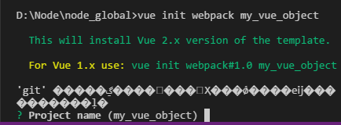
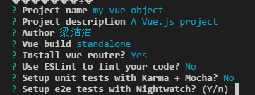
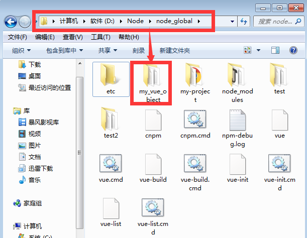
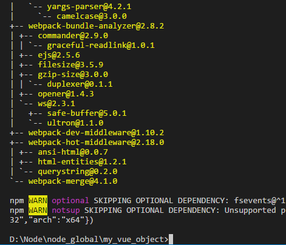
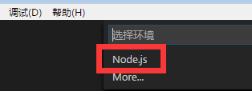
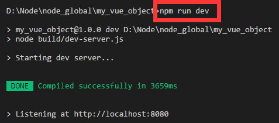
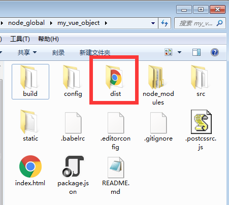

Vue 第一站：从安装到打包
===

> create by **jsLe** on **2017-05-19**  
> Recently revised in **2019-05-23 19:45:23**

大家好，不知不觉又是周五，这周你都做了啥？都学到了啥？尝试让自己更好吧！  

OK，直奔主题,这周我们讲讲 Vue 从安装到构建项目：  

1、下载安装 Visual Studio Code，这里提供的是官网下载（英文网站，点击右手边的 download 即可）  

* 》[VS Code 官网](https://code.visualstudio.com/)《  

2、安装 Node.js 并配置环境：  

* 》[Node.js 安装及环境配置之 Windows 篇](http://www.cnblogs.com/yzadd/p/6547668.html)《`已失效`  
* 》[Node.js 下载](http://nodejs.cn/download/)《  
* 》[淘宝 NPM 镜像](https://npm.taobao.org/)《  

3、安装 Vue： 

* 方法一：使用 cmd 的命令行安装（Node.js 安装文章教过你怎么打开了）。  
* 方法二：使用 VS Code 的集成终端（道理和 cmd 一样，就是界面比 cmd 好看了点）：  

下面一步一步讲解如何安装：  

1、全局安装 vue-cli：`npm install --global vue-cli` 

安装完成后可以在 `C:\Users\Administrator\AppData\Roaming\npm` 目录下（如果你配置了 Node 的文件存放位置，请到 Node 安装目录中找文件

> 找到安装的文件：

2、创建一个基于webpack模板的新项目：先用命令行 `cd /d D:\Node\node_global`，切换到你要存放项目的工作空间，然后使用命令行 `vue init webpack vueobject` 创建项目，`vueobject` 就是你的名字，下面通过图文讲解我怎么创建一个新的项目的：  

> （给项目找个存放位置）  

> （询问你项目名称，默认为（）里面的 `my_vue_object`，我直接回车）  

> （询问你项目描述，默认为（）里面的 `A Vue.js project`，没啥描述，直接回车）  

> （询问你作者，嗯，梁渣渣）  

> （询问你使用哪个？可以使用↑↓来选择，它说大多数人用第一个，那就 Enter 第一个吧）  

> （是否安装 `vue-router`，这是官方的路由，大多数情况下都使用，就 `y` 然后 `enter`吧）  

> （是否使用 `ESLint` 管理代码，`ESLint` 是个代码风格管理工具，是用来统一代码风格的，并不会影响整体的运行，这也是为了多人协作，新手就不用了，一般项目中都会使用。所以选 `n` 并 `Enter` 吧）  

> （是否安装单元测试，Karma 和 Mocha，详细你们去了解吧，这里选择 `n`）  

> （是否安装 e2e 测试，这里我还是选择 `n`）  

至此，我们的安装就完成了，打开文件查看下确认是否安装：  

接下来我们将 cmd 切换到我们项目所在的位置，或者你将 my_vue_object 文件夹拖到 Visio Studio Code（由于楼主没有安装好，没法直接用右键文件夹用 Visio Studio Code 打开，所以一般都是把文件拖入到 VS Code），并打开集成终端，就可以直接切换到项目所在位置了：  

然后我们安装所有的依赖：`npm install`

（正在安装）  

（安装完毕）  

可以看到我们的 my_vue_object 文件夹中多了个依赖文件了：  

接下来就是打开项目了，你可以使用 VS Code：  

或者使用命令行：`npm run dev`

最终网页展示，至此，我们的项目搭建完成啦！  

接下来大致说下打包，打包的命令是：`npm run build`。当然打包不是直接敲这个命令行就 OK 了。  

**首先**，我们需要找到 `config/index.js`，修改下路径：  

**然后**，找到 `build/build.js`，注释掉两句话：  

**最后**，我们在集成终端 `cmd` 输入 `npm run build`，它运行后：  

可以看到我们的项目文件夹中多了个 dist，说明我们成功了，平时我们需要打开环境才能运行的项目，在这里打包成功了，我们可以直接用浏览器打开了（你可以试下把编辑器关了），在这里我就不演示了。  

因为我也是新手，如果你觉得我说得不够透彻，可以看看其他人写的怎么安装vue：》[点击前往](http://www.jianshu.com/p/2769efeaa10a)《  

最后我们来个小总结：  

在这篇文章中，一些新词我会尽量给你我找到的解释，如果你看到自己不懂的，OK，百度，如果还不懂，OK，再百度。意思就是：没有百度一遍搞不定的，如果有，那就百度两遍！谁都是这么过来的。我写这篇文章，只是给你一个我认为还OK的“捷径”，并不是说，手把手教你从头到尾。  

在这里 Vue 的从安装到运行就结束了，如果操作过程有疑惑，然后你百度后还不懂，可以加我 QQ 或者微信询问（我不一定能帮你解决，但我一定是搜索过我的小脑袋瓜帮你解决了）。

谢谢你的阅读，希望你的前端之路更进一步。  

—— 梁^_^飘

>  jsLe的文档库 由 <a xmlns:cc="http://creativecommons.org/ns#" href="https://github.com/LiangJunrong/document-library" property="cc:attributionName" rel="cc:attributionURL">梁峻荣</a> 采用 <a rel="license" href="http://creativecommons.org/licenses/by-nc-sa/4.0/">知识共享 署名-非商业性使用-相同方式共享 4.0 国际 许可协议</a>进行许可。 基于<a xmlns:dct="http://purl.org/dc/terms/" href="https://github.com/LiangJunrong/document-library" rel="dct:source">https://github.com/LiangJunrong/document-library</a>上的作品创作。 本许可协议授权之外的使用权限可以从 <a xmlns:cc="http://creativecommons.org/ns#" href="https://creativecommons.org/licenses/by-nc-sa/2.5/cn/" rel="cc:morePermissions">https://creativecommons.org/licenses/by-nc-sa/2.5/cn/</a> 处获得。